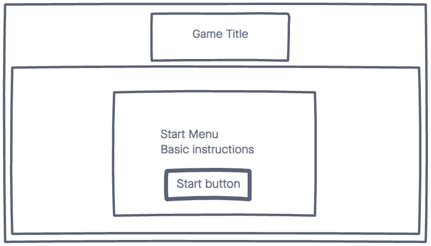
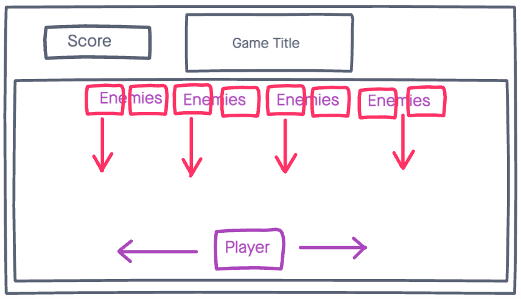

### Project 1 "Get the Poo"

## Space Invaders style game
Welcome to my Space Invaders styled game, called "_**Get the Poo**_". For our Project 1, I was interested in building a Space Invaders style game to test my HTML, CSS, and JS abilities. Part way through the project I was in the backyard, taking a much needed fresh air break, and I had the distinct pleasure of stepping in some fairly fresh dog poo. I wasn't very excited about getting to thoroughly clean my shoe, but decided instead to try to focus that energy into a theme for my game. 

In "_**Get the Poo**_", as the player is enjoying a sunny afternoon lounging in the grass, they can't help but notice a swarm of smiling dog poos throughout the grass. It's going to be tricky not to get hit by the poo. With the aid of the **"a"** and **"d" keys** on the the keyboard, the player controls a Mickey Mouse styled hand at the bottom of the screen, moving the hand from left to right. With a steady hand and firm grip, the user must deploy poop bags, using the _**space bar**_ at the attacking poos in hopes that thier shoes may live to see another day.

## Tech:
HTML
CSS
Javascript

## Initial Wireframes

## MVP
1. Players character generates on play area. Character can move from left to right across the width of the play area. Character can launch projectiles at enemies.
2. Enemies generate on play area. Drop down towards character. 
3. Player projectiles destroy enemy when hit.
4. Player looses when hit by enemy or enemy reaches bottom of play area.
5. End game screen, with message saying the game is over, player score, and a restart game button.
6. Start button to initialize the game. 

## Win/Lose Conditions
1. Player looses when number of lives reaches zero.
    - Lose life from being hit by enemy
    - Lose life from not hitting enemy before they reach bottom of play area.
2. Track score for successful hits.

## Stretch Goals
- Possibly limit projectiles to a finite number.
1. Add additional levels. After a certain number of enemies, level ends and a new level begins.
2. As player progresses, enemies move more and more quickly.
3. As player progresses, incease number of enemies on the screen. 
4. Track and log high scores.
5. Additional animations on enemy destruction and player fail.